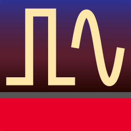
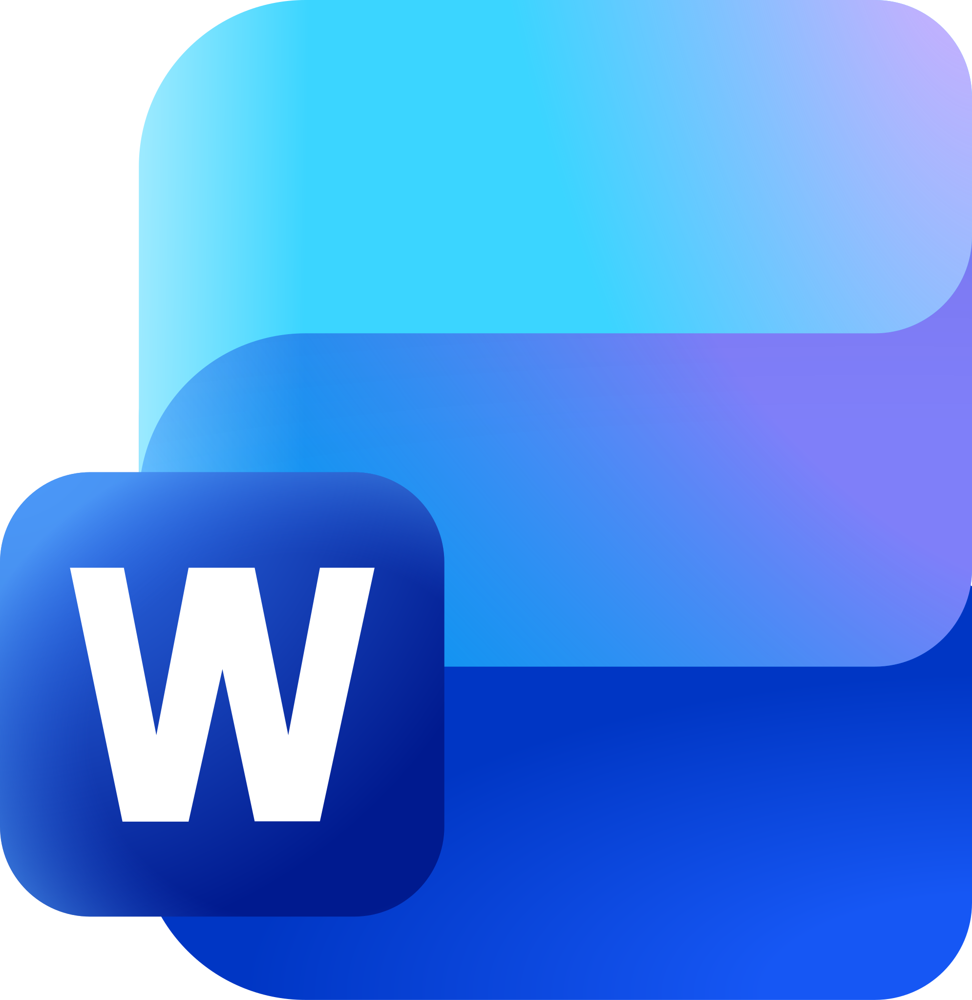

<h1 align="center">Assalamualaikum, I'm Rifko 😎</h1>

### 👨‍💻 About Me

I am a D4 Telecommunication Engineering student at Politeknik Negeri Bandung with a strong interest in telecommunication systems and modern network technologies.

**My key interests include:**
- Network infrastructure  
- Cybersecurity  
- Satellite communication  

I also have hands-on experience in **IoT hardware development** using **ESP32, Arduino, and RFID**, as well as software projects involving **Java** and **MySQL**.
I’m familiar with industry tools such as **Cisco Packet Tracer**, **PNetLab**, **CST Studio Suite**, and **Proteus**.
I am committed to applying my academic foundation to real-world industry environments while continuously improving my technical and professional skills to contribute to digital innovation in Indonesia.

#### 🤝 Connect with me:
  

#### 💻 Programming Languages (Basic Level):
  

#### 🛠️ Tools & Technologies:
         

